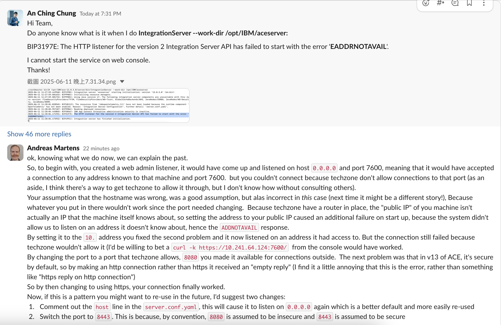

# IBM-App-Connect-Enterprise-Install


# IBM App Connect Enterprise Install

## Install ACE on Linux
## Overview
This guide provides step-by-step instructions for installing and configuring IBM App Connect Enterprise (ACE) 13.0.3.0 on a Linux environment.

## 1. File Transfer 傳檔案

### SSH Login
Connect to the remote server using SSH with a private key:
```bash
ssh -i ~/Downloads/pem_ibmcloudvsi_download_0609.pem itzuser@169.59.188.67
su -
```

### SCP File Transfer
Transfer the IBM ACE installation file to the remote server:
```bash
scp -i ~/Downloads/pem_ibmcloudvsi_download_0610.pem -P 2223 /Users/zhonganqing/DownloadDirector/IBM_ACE_13.0.3.0_LNX_X8664_INCTK.tar.gz itzuser@169.59.188.45:~
```
ex.
```bash
scp -i ~/Downloads/pem_ibmcloudvsi_download_0609.pem -P 2223 /Users/XXX/DownloadDirector/IBM_ACE_13.0.3.0_LNX_X8664_INCTK.tar.gz itzuser@169.59.188.67:~
```
**Note**: Avoid using `scp -p 2223` (lowercase `-p` is for preserving file attributes, not port specification; use `-P` instead).



## 2. Extraction

### Create Directory and Extract Files
```bash
mkdir /opt/IBM
cp /home/itzuser/IBM_ACE_13.0.3.0_LNX_X8664_INCTK.tar.gz /opt/IBM
cd /opt/IBM
tar -xzvf /opt/IBM/IBM_ACE_13.0.3.0_LNX_X8664_INCTK.tar.gz
```

## 3. License and SSL Configuration 許可證與 SSL 配置

### Navigate and Accept License Silently
```bash
cd ace-13.0.3.0
./ace make registry global accept license silently
```

Output: License accepted, and SSL certificates (admin and HTTPSConnector) are generated with validity from June 11, 2025, to June 9, 2035.


---


---

## 4. Load Environment Variables 載入環境變數

### Set and Persist Environment
```bash
cd /opt/IBM/ace-13.0.3.0/server/bin
. mqsiprofile
# OR
. /opt/IBM/ace-13.0.3.0/server/bin/mqsiprofile
```
**Persist in `.bashrc`:**
```bash
echo '. /opt/IBM/ace-13.0.3.0/server/bin/mqsiprofile' >> ~/.bashrc
source ~/.bashrc
```
**Note**: If `mqsiprofile repetition disallowed` appears, it indicates the profile is already loaded.

---


---

## 5. Server Initialization 初始化伺服器

### List Integration Nodes
```bash
./mqsilist
```
**Output**: `BIP1281I: No integration nodes have been defined on this machine.`


## 6. Create an Integration Server

### Start Integration Server
```bash
cd /opt/IBM/ace-13.0.3.0/server/bin
IntegrationServer --work-dir /opt/IBM/aceserver
# OR with console log
IntegrationServer --work-dir /opt/IBM/aceserver --console-log
```
**Expected Output**: `Integration server has finished initialization`  
**Note**: A `server.conf.yaml` template is copied to `/opt/IBM/aceserver`.

![Integration Server Start Screenshot]


## 7. Configure RestAdminListener (開一個新視窗)

### Open New Terminal Window
```bash
cd /var/mqsi
cd /opt/IBM/ace-13.0.3.0/server/bin
cd /opt/IBM/aceserver
vi /opt/IBM/aceserver/server.conf.yaml
```


### Modify `server.conf.yaml` 找到 RestAdminListener 這區塊，把註解拿掉並修改
Uncomment and edit the `RestAdminListener` section:
```yaml
RestAdminListener:
  port: 7600                # Set the Admin REST API Port for ACE Web UI and Toolkit or -1 to disable. Defaults to 7600.
  host: '169.59.188.67'     # Set the hostname otherwise we bind to the unspecified address
```
Save and close the file.

如果在 TechZone 環境要改 8080 和 Private IP
```yaml
RestAdminListener:
  port: 8080               # Set the Admin REST API Port for ACE Web UI and Toolkit or -1 to disable. Defaults to 7600.
  host: '10.241.64.124'     # Set the hostname otherwise we bind to the unspecified address
```


## 8. Restart and Access Admin UI

### Restart Server
In the original terminal (running `IntegrationServer`):
- Press `Ctrl + C` to stop:
  **Output**: `Integration server is terminating due to a shutdown event`
- Restart:
  ```bash
  /opt/IBM/ace-13.0.3.0/server/bin/IntegrationServer --work-dir /opt/IBM/aceserver
  ```


### Enable Admin Web UI
- After restarting, open a browser and navigate to:
  ```
  https://169.59.188.67:7600/
  ```
在 TechZOne 上用 Public IP 169.59.167.68: https://169.59.167.68:8080/


## 9. Debugging

### 移除鎖定檔：
```bash
rm -f /opt/IBM/aceserver/run/*
rm -f /opt/IBM/aceserver/config/.lock
```


### Check Integration Server Process
```bash
ps -ef | grep IntegrationServer
```

If running, terminate with:
```bash
kill -9 <PID>
```

### Check Logs
```bash
cat /opt/IBM/aceserver/log/*
```


### Check Firewall
```bash
sudo firewall-cmd --list-all
sudo firewall-cmd --permanent --add-port=7600/tcp
sudo firewall-cmd --reload
```

### Verify Port 7600
```bash
yum install lsof -y
```

```bash
netstat -tulnp | grep 7600
ps -ef | grep 7600
```


### Remove Lock Files
If no duplicate processes, check for lock files:
```bash
ls -l /opt/IBM/aceserver/config/.lock
ls -l /opt/IBM/aceserver/run/.lock
```
If they exist, remove them:
```bash
rm /opt/IBM/aceserver/config/.lock
rm /opt/IBM/aceserver/run/.lock
```
Restart the server:
```bash
. /opt/IBM/ace-13.0.3.0/server/bin/mqsiprofile
/opt/IBM/ace-13.0.3.0/server/bin/IntegrationServer --work-dir /opt/IBM/aceserver
```

## 為何在 TechZone 上要改 port 從 7600 到 8080

# 問題說明與未來建議（TechZone + ACE v13 Web 管理介面）

了解現在的狀況後，我們可以回頭解釋發生了什麼事：

## 問題過程回顧

- 一開始，你建立了一個 Web Admin Listener，它預設會在主機 `0.0.0.0` 的 port `7600` 上啟動，代表它會接受該機器所有已知 IP 上的連線。
- 但你無法連線，因為 **TechZone 不允許連到 port 7600**。  
  >（補充：據我所知，TechZone 是可以設定開放特定 port，但我得去問其他人才能確認怎麼做。）

- 你原本以為是 hostname 錯了，這是個合理的假設，但在這個案例中不是正確的解法（但未來不一定）。
- 實際上是因為：
  - TechZone 架構中有一層 router，**機器的「public IP」其實不是它自己知道的 IP**。
  - 所以你把 address 設成 public IP 時，啟動時會出錯，因為系統無法 listen 在一個它不認識的 IP 上，導致出現 `ADDNOTAVAIL` 錯誤。

## 問題排解歷程

- 當你改成使用 `10.x.x.x` 的內部地址，解決了第二個問題，系統成功在能識別的 IP 上啟動 listener。
- 但仍無法連線，因為 **TechZone 還是不允許使用 port 7600**。  
  > 我敢打賭，若你從 console 執行 `curl -k https://10.241.64.124:7600/` 是會成功的。

- 當你把 port 改成 TechZone 允許的 `8080`，外部連線終於可行了。
- 下一個問題是：**ACE v13 預設啟用 TLS**，所以你用 `http` 連時會收到「empty reply」。
  >（說實話我覺得這錯誤訊息不太友善，應該要顯示「https 回應送給 http 請求」之類的才對）

- 最後，你改用 `https` 連線，一切就成功了。


## 未來最佳實踐建議

### 1. 註解主機行

在 `server.conf.yaml` 中註解 `host` 行，讓其默認監聽 `0.0.0.0`。  
**優點**：這是一個更靈活的默認設置，適用於多種環境並易於重用。

```yaml
RestAdminListener:
  port: 8443
  # host: '10.241.64.124'  # 註解掉此行
```

### 2. 切換端口至 8443

將端口設為 `8443`，因為慣例上 `8080` 被視為不安全端口，而 `8443` 被視為安全端口（HTTPS）。

更新後配置示例：

```yaml
RestAdminListener:
  port: 8443
  # host: '10.241.64.124'  # 註解掉此行
```

### 3. 應用步驟

- 編輯 `server.conf.yaml`：
```bash
vi /opt/IBM/aceserver/server.conf.yaml
```

- 保存後重啟伺服器：
```bash
pkill -f IntegrationServer
/opt/IBM/ace-13.0.3.0/server/bin/IntegrationServer --work-dir /opt/IBM/aceserver
```

- 驗證連接：使用 `https://<hostname>:8443` 測試。


.

.
---
---
---


  
# 在 Windows 上安裝 ACE v12

## 概述
本指南提供在 Windows 環境中安裝 IBM App Connect Enterprise (ACE) v13 的詳細步驟。

## 1. 解壓與安裝

### 步驟 1: 解壓安裝檔案
- 將 `IBM_ACE_13.0.3.0_WIN_X8664_INCTKT.zip` 解壓到任意資料夾。

### 步驟 2: 執行安裝程式
- 以管理員身份運行 `ACESetup13.0.x.0.exe`，接受許可證並完成安裝（約 5 分鐘）。


## 2. 啟動 Toolkit

### 步驟 3: 搜尋並啟動 Toolkit
- 在 Windows 左下角搜尋「IBM App Connect Enterprise Toolkit 13.0.3.0」，點擊後從開始菜單中選擇「Launch IBM App Connect Enterprise Console」。


## 3. 配置與連接

### 步驟 4: 初次啟動與設置
- 啟動後會跳出 `https://localhost:7500` 的網站。
- 出現視窗時，勾選「Exclude IBM App Connect」選項。


### 步驟 5: 移除 Welcome 頁面並連接伺服器
- 關閉左上方「Welcome」標籤頁。
- 點擊左下角「Integration Server」，右鍵選擇「Connect to an Integration Server」（第二個選項）。


### 步驟 6: 輸入主機與端口
- 輸入 `Host Name` 和 `Port`（其他留空）。


### 步驟 7: 信任證書 Trust Certificate
- 按下「Trust Certificate」按鈕。


## 4. 開啟 Web 主控台

### 步驟 8: 開啟 Web 界面
- 右鍵「Integration Server」，選擇「Open Web User Interface」。


### 步驟 9: 驗證 Web 主控台
- 跳出 Web 主控台，確認正常顯示。


## 注意事項
- 不一定要以管理員身份運行安裝程式。
- 確認端口 7500 未被其他應用占用，若有問題可檢查防火牆設置。

